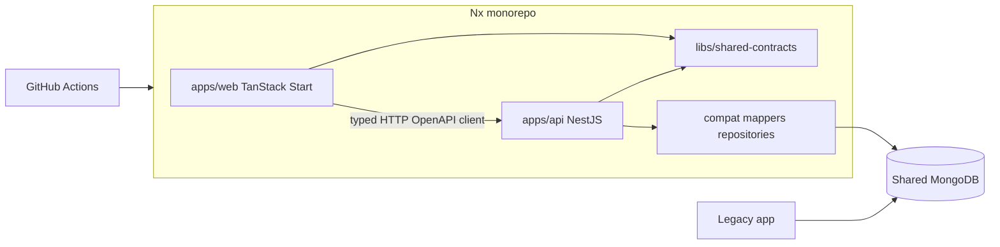
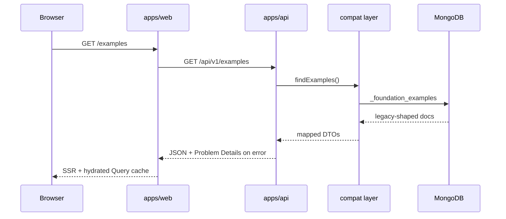

# Greenfield Foundation Roadmap: NestJS + TanStack Start + Nx (July 2026)

Самостоятельная дорожная карта для монорепозитория **с нуля**: платформенный костяк без доменных фич, на который потом наращивается продукт. Предполагается **существующая MongoDB** (shared DB со старым приложением) и подход strangler fig. Этот файл — **единственный источник правды** для фундамента; внешние материалы этого репозитория не требуются.

### Как пользоваться

1. Положи этот файл в `docs/` целевого репозитория (имя файла можно оставить или переименовать в `FOUNDATION_ROADMAP.md`).
2. Инициализируй пустой git-репозиторий и начни с **шага 001**.
3. Выполняй шаги по порядку треков (или по [рекомендуемому потоку](#6-порядок-выполнения-треков)).
4. После каждого шага обновляй [Прогресс](#прогресс-обновляй-в-этом-репозитории): статус шага (`todo` → `doing` → `done`), блок **Текущий этап**, сводку треков.
5. В работе одновременно только **один** шаг в статусе `doing`.
6. Не начинай доменные legacy-коллекции, пока Track 10 не закрыт.

---

## Содержание

1. [Цель и границы](#1-цель-и-границы)
2. [Целевая архитектура](#2-целевая-архитектура)
3. [Стек и версии (июль 2026)](#3-стек-и-версии-июль-2026)
4. [Shared MongoDB и legacy-приложение](#4-shared-mongodb-и-legacy-приложение)
5. [Политики качества (не опционально)](#5-политики-качества-не-опционально)
6. [Порядок выполнения треков](#6-порядок-выполнения-треков)
7. [Track 0 — Workspace Bootstrap (001–018)](#track-0--workspace-bootstrap-001018)
8. [Track 1 — Local Quality Gates (019–024)](#track-1--local-quality-gates-019024)
9. [Track 2 — Shared Contracts (025–030)](#track-2--shared-contracts-025030)
10. [Track 3 — API Platform (031–048)](#track-3--api-platform-031048)
11. [Track 4 — Mongo Data Skeleton (049–058)](#track-4--mongo-data-skeleton-049058)
12. [Track 5 — Web Platform (059–068)](#track-5--web-platform-059068)
13. [Track 6 — Testing Iron (069–076)](#track-6--testing-iron-069076)
14. [Track 7 — CI/CD (077–084)](#track-7--cicd-077084)
15. [Track 8 — Contract Bridge (085–088)](#track-8--contract-bridge-085088)
16. [Track 9 — Observability Stub (089–092)](#track-9--observability-stub-089092)
17. [Track 10 — Acceptance (093–096)](#track-10--acceptance-093096)
18. [Ключевые архитектурные решения](#18-ключевые-архитектурные-решения)
19. [После фундамента: первый доменный модуль](#19-после-фундамента-первый-доменный-модуль)
20. [Шаблоны артефактов](#20-шаблоны-артефактов)
21. [Внешние ссылки](#21-внешние-ссылки)
22. [Прогресс](#прогресс-обновляй-в-этом-репозитории)

---

## 1. Цель и границы

### Намерение

Построить **фундамент**, на котором дальше можно думать только о фичах:

- монорепо с предсказуемым DX;
- API с единым форматом ошибок, валидацией и health;
- web с TanStack Start + Router + Query + Form;
- **MongoDB-ready** слой с правилами жизни рядом с legacy;
- Vitest на каждое изменение production-кода;
- GitHub Actions без дыр: format, lint, typecheck, build, unit, e2e.

### «Фундамент готов» (Track 10)

| Критерий                                                            | Проверка                             |
| ------------------------------------------------------------------- | ------------------------------------ |
| `npm run ci` зелёный локально и в GitHub Actions (ubuntu + windows) | merge без обхода hooks               |
| API: `/health`, `/health/ready` (Mongo ping), `/api/v1/examples/*`  | curl + e2e                           |
| Web: SSR shell, demo route с Query + Form к example API             | `nx run web:build`                   |
| Shared contracts: health + Problem Details + example DTO            | unit-тесты Zod                       |
| Mongo: MongooseModule, compat pattern, `_foundation_examples`       | e2e с Mongo service                  |
| Tests-first gate активен                                            | commit без spec → fail               |
| Coverage thresholds включены                                        | CI fail при регрессе                 |
| OpenAPI → typed web client без drift                                | CI check                             |
| ADR «shared Mongo with legacy» принят                               | файл в `docs/adr/`                   |
| Inventory stub для legacy-коллекций                                 | `docs/data/collections-inventory.md` |

### Anti-goals (вне scope T0–T10)

- Миграция на Postgres / TypeORM / Prisma.
- Полный rewrite схемы Mongo или смена индексов legacy без ADR.
- Auth, RBAC, CMS, billing, email-продукт.
- Подключение к **production** Mongo из CI (только dev/CI URI).
- Cloud deploy (Railway/Vercel/Fly) — отдельный track после T10.

---

## 2. Целевая архитектура



### Каноническое дерево каталогов

```text
.
├── apps/
│   ├── api/                    # NestJS 11
│   │   ├── src/
│   │   │   ├── config/
│   │   │   ├── database/       # MongooseModule, connection
│   │   │   ├── errors/
│   │   │   ├── health/
│   │   │   ├── examples/       # foundation write demo
│   │   │   └── compat/         # legacy mappers (pattern)
│   │   ├── test/               # *.e2e-spec.ts
│   │   └── vitest.config.ts
│   └── web/                    # TanStack Start
│       ├── src/
│       │   ├── routes/
│       │   ├── lib/api-client/
│       │   └── components/
│       └── vitest.config.ts
├── libs/
│   └── shared-contracts/       # Zod + types
├── docs/
│   ├── adr/
│   └── data/
│       └── collections-inventory.md
├── scripts/
│   ├── validate-tests-first.mjs
│   ├── husky-pre-commit.mjs
│   └── run-staged-tests.mjs
├── .github/workflows/ci.yml
├── docker-compose.yml          # mongo (+ mongo-express optional)
├── nx.json
├── tsconfig.base.json
├── eslint.config.mjs
└── package.json
```

### Документы и скрипты, которые появятся по ходу

Все пути ниже **создаёшь ты** в указанных шагах. До этого шага файла в репозитории нет.

| Путь                                                    | Создаётся в шаге |
| ------------------------------------------------------- | ---------------- |
| `docs/LOCAL_SETUP.md`                                   | 002              |
| `scripts/validate-tests-first.mjs`                      | 021              |
| `scripts/husky-pre-commit.mjs` / `run-staged-tests.mjs` | 019–022          |
| `docs/data/collections-inventory.md`                    | 056              |
| `docs/testing.md`                                       | 076              |
| `.github/workflows/ci.yml`                              | 077              |
| `docs/adr/001-shared-mongodb-with-legacy.md`            | 093              |
| `docs/track-foundation-acceptance.md`                   | 094              |

### Поток запроса (reference)



---

## 3. Стек и версии (июль 2026)

| Слой            | Технология                             | Версия (pin после bootstrap)          |
| --------------- | -------------------------------------- | ------------------------------------- |
| Runtime         | Node.js                                | 24.x (`.nvmrc`)                       |
| Package manager | npm workspaces                         | 10.x                                  |
| Monorepo        | Nx                                     | ~22.7                                 |
| API             | NestJS                                 | 11.x                                  |
| HTTP validation | class-validator + class-transformer    | явный semver в lock                   |
| Env validation  | @nestjs/config + Zod                   | Zod 3.25+                             |
| Database        | MongoDB + @nestjs/mongoose + Mongoose  | Mongo 7.x local                       |
| Web             | TanStack Start + Router + Query + Form | Start/Router 1.x, Query 5.x, Form 1.x |
| UI              | React + Vite + Tailwind CSS            | React 19, Vite 8, Tailwind 4          |
| Tests           | Vitest + @vitest/coverage-v8           | 4.x                                   |
| API e2e         | supertest                              | явный semver в lock                   |
| CI              | GitHub Actions                         | checkout/setup-node/cache v6/v5       |
| Hooks           | husky + lint-staged                    | 9.x / 15.x                            |

**Правило:** после шага 001 зафиксировать версии в `package-lock.json`. Не использовать `latest` в production dependencies — только явные semver.

**npm scope / path alias:** в шагах 001–006 выбери scope (например `@myapp/*` или `@app/*`) и зафиксируй его в `tsconfig.base.json` и `package.json` либ. Ниже в таблицах `@app/shared-contracts` — только пример.

---

## 4. Shared MongoDB и legacy-приложение

### Модель: Strangler Fig

Новое приложение постепенно заменяет старое; **одна БД**. Это снимает миграцию данных на старте, но требует дисциплины совместимости.

| Плюс                     | Риск                                          |
| ------------------------ | --------------------------------------------- |
| Нет big-bang миграции    | Два writer'а в одну коллекцию                 |
| Реалистичный prod-навык  | Тихое изменение shape документа ломает legacy |
| Поэтапный rollout UI/API | Индексы/TTL без inventory — опасно            |

### Правила фундамента

1. **Compat-слой обязателен:** `LegacyDocument` → `AppDto` (read), `CreateDto` → `LegacyWriteDocument` (write). Mongoose schema описывает **фактический** legacy shape, не «идеальную» доменную модель.
2. **Additive evolution:** пока жив legacy — только optional новые поля. Rename/delete — ADR + dual-read/dual-write план.
3. **Write в фундаменте** — только коллекция `_foundation_examples` (или префикс `_foundation_`). Боевые legacy-коллекции — **read-only** до закрытия T10 и заполнения inventory.
4. **Тесты не ходят в prod Mongo:** локально `docker compose up mongo`; CI — GitHub service `mongo:7` или Testcontainers; unit — mocks.
5. **Readiness:** `/health/ready` = process up **и** Mongo ping ok.
6. **Secrets:** `MONGODB_URI` только через env; redact в логах.

### ADR (обязателен в T10)

Файл `docs/adr/001-shared-mongodb-with-legacy.md`:

- кто пишет в какие коллекции;
- политика additive schema;
- когда разрешён write в legacy-коллекции;
- rollback при конфликте версий приложений.

---

## 5. Политики качества (не опционально)

### Tests-first gate

Скрипт `scripts/validate-tests-first.mjs` создаётся на шаге **021** по полной спецификации в [§20](#validate-tests-firstmjs-reference-implementation).

| Изменение                            | Требование в том же PR/commit              |
| ------------------------------------ | ------------------------------------------ |
| `apps/api/src/**` (не `*.spec.ts`)   | ≥1 `apps/api/**/*.spec.ts` или `*.test.ts` |
| `apps/web/src/**` (не test file)     | ≥1 `apps/web/**/*.test.{ts,tsx}`           |
| `libs/shared-contracts/src/**`       | unit-тест схем/типов                       |
| Только `apps/api/test/*.e2e-spec.ts` | **не** закрывает gate для production diff  |

Запуск: pre-commit (staged), CI (diff range), `npm run ci`.

### Vitest: слои тестов

| Слой        | Где                                   | Зависимости                            |
| ----------- | ------------------------------------- | -------------------------------------- |
| Unit        | `*.spec.ts` рядом с кодом             | mocks, без сети/БД                     |
| Integration | `*.integration.spec.ts` (опционально) | Mongo memory / test container          |
| E2E API     | `apps/api/test/*.e2e-spec.ts`         | supertest + Nest TestingModule + Mongo |
| Web         | `*.test.tsx`                          | Testing Library, mock fetch            |
| Contracts   | `libs/shared-contracts/**/*.spec.ts`  | Zod parse fixtures                     |

### Coverage thresholds (стартовые)

| Project                           | Lines | Branches | Functions |
| --------------------------------- | ----- | -------- | --------- |
| `shared-contracts`                | ≥90%  | ≥85%     | ≥90%      |
| `api` (services, compat, mappers) | ≥80%  | ≥75%     | ≥80%      |
| `web` (lib/api-client, providers) | ≥75%  | ≥70%     | ≥75%      |

Пороги только растут. Регресс в CI = fail.

### Definition of Done (любой шаг)

1. Код + тесты в одном changeset.
2. `nx affected -t lint,typecheck,build,test` зелёный.
3. При HTTP — e2e smoke или расширение существующего e2e.
4. `.env.example` обновлён при новых env vars.
5. Шаг отмечен done в таблице [Прогресс](#прогресс-обновляй-в-этом-репозитории) ниже.

### CI merge block

Все обязательны:

- `npm run format:check`
- `nx affected -t lint` (`--max-warnings=0`)
- `nx affected -t typecheck`
- `nx affected -t build`
- `nx affected -t test`
- `nx affected -t test:e2e` (где project имеет target)

---

## 6. Порядок выполнения треков

**Рекомендуемый поток (не по номерам шагов, а по риску):**

```text
День 1–2:   T0 (001–018) — скелет монорепо
День 2:     T1 (019–024) + T7 skeleton (077–080) — hooks + CI каркас
День 3–4:   T2 (025–030) + T3 (031–048) — contracts + API platform
День 4–5:   T6 (069–076) — coverage + gates (можно параллельно с T3)
День 5–6:   T4 (049–058) — Mongo
День 6–7:   T5 (059–068) — Web
День 7–8:   T7 finish (081–084) + T8 (085–088) + T9 (089–092)
День 8:     T10 (093–096) — acceptance
```

**Не начинать доменные legacy-коллекции до закрытия T10.**

---

## Track 0 — Workspace Bootstrap (001–018)

| Step | Title                          | Что создать                                                    | Verification                    | DoD                  | Тесты                               |
| ---- | ------------------------------ | -------------------------------------------------------------- | ------------------------------- | -------------------- | ----------------------------------- |
| 001  | Init git + root `package.json` | workspaces `apps/*`, `libs/*`; scripts stub; выбрать npm scope | `npm install`                   | repo clean           | —                                   |
| 002  | Node policy                    | `.nvmrc`, `engines`, создать `docs/LOCAL_SETUP.md`             | `node -v`                       | версия зафиксирована | —                                   |
| 003  | Nx init                        | `nx.json`, `@nx/eslint`, `@nx/vite`                            | `npx nx show projects`          | projects visible     | —                                   |
| 004  | Nx target defaults             | cache, dependsOn для build/test                                | `nx run api:build` (stub ok)    | inference works      | —                                   |
| 005  | Nest in `apps/api`             | `@nestjs/cli` scaffold, `project.json`                         | `nx run api:build`              | api project          | smoke spec `app.controller.spec.ts` |
| 006  | tsconfig base + paths          | alias выбранного scope → `libs/*/src`                          | `tsc -b`                        | paths resolve        | —                                   |
| 007  | ESLint flat config             | root + per-project overrides                                   | `nx run api:lint`               | 0 errors             | —                                   |
| 008  | Prettier + EditorConfig        | `.prettierrc`, `.editorconfig`                                 | `npm run format:check`          | format clean         | —                                   |
| 009  | Root scripts via Nx            | `build`, `test`, `lint`, `typecheck`                           | `npm run build`                 | all projects         | —                                   |
| 010  | TanStack Start `apps/web`      | Start scaffold, Nitro plugin                                   | `nx run web:build`              | web builds           | import test                         |
| 011  | `web:typecheck` target         | `tsc --noEmit` or vite checker                                 | `nx run web:typecheck`          | target exists        | —                                   |
| 012  | `libs/shared-contracts`        | empty lib + build target                                       | `nx run shared-contracts:build` | lib builds           | placeholder spec                    |
| 013  | Wire contracts → API           | tsconfig paths, sample import                                  | `nx run api:build`              | compiles             | spec imports type                   |
| 014  | Wire contracts → web           | same                                                           | `nx run web:build`              | compiles             | spec                                |
| 015  | CORS + dev origins             | env `WEB_ORIGIN`, Nest enableCors                              | manual preflight                | dev UX               | e2e stub                            |
| 016  | Mongo compose                  | `docker-compose.yml` mongo:7, port 27017                       | `docker compose up -d`          | container healthy    | —                                   |
| 017  | `.env.example`                 | root + apps/api + apps/web                                     | review                          | no secrets           | —                                   |
| 018  | Root README runbook            | how to run api/web/mongo/ci                                    | review                          | newcomer can start   | —                                   |

---

## Track 1 — Local Quality Gates (019–024)

| Step | Title                      | Что создать                                                | Verification         | DoD                    | Тесты                     |
| ---- | -------------------------- | ---------------------------------------------------------- | -------------------- | ---------------------- | ------------------------- |
| 019  | husky install              | `.husky/pre-commit`, `pre-push`; скрипты в `scripts/`      | commit triggers hook | hooks run              | —                         |
| 020  | lint-staged                | prettier + eslint on staged (конфиг в root `package.json`) | bad format blocked   | staged only            | —                         |
| 021  | `validate-tests-first.mjs` | создать скрипт **по спецификации §20**                     | fail without spec    | gate works             | script self-test optional |
| 022  | `run-staged-tests.mjs`     | создать скрипт: unit-тесты затронутых projects             | fast feedback        | <30s typical           | —                         |
| 023  | `npm run ci`               | mirror CI locally                                          | full green           | parity list documented | —                         |
| 024  | `.gitignore` normalize     | node_modules, .nx, coverage, .env                          | clean status         | no leaks               | —                         |

---

## Track 2 — Shared Contracts (025–030)

| Step | Title                    | Что создать                 | Verification          | DoD                | Тесты                 |
| ---- | ------------------------ | --------------------------- | --------------------- | ------------------ | --------------------- |
| 025  | Problem Details types    | RFC 9457 shape in contracts | build                 | types exported     | schema parse tests    |
| 026  | Health response schemas  | liveness + readiness DTOs   | build                 | shared api/web     | zod roundtrip         |
| 027  | Example resource schemas | create/list response Zod    | build                 | example contract   | invalid payload tests |
| 028  | Error code constants     | enum/union of `type` URIs   | build                 | stable codes       | snapshot optional     |
| 029  | Wire filter → contracts  | API filter imports types    | unit test error shape | single source      | contract test         |
| 030  | Web imports health types | type-only in client         | web build             | no duplicate types | import test           |

---

## Track 3 — API Platform (031–048)

| Step | Title                      | Что создать                         | Verification         | DoD           | Тесты           |
| ---- | -------------------------- | ----------------------------------- | -------------------- | ------------- | --------------- |
| 031  | ConfigModule + Zod env     | `MONGODB_URI`, `PORT`, `NODE_ENV`   | boot fail on bad env | fail-fast     | env schema spec |
| 032  | Global ValidationPipe      | whitelist, transform, forbidUnknown | 400 on extra fields  | consistent    | e2e             |
| 033  | ApiExceptionFilter         | map to `application/problem+json`   | unit + e2e           | no stack leak | filter spec     |
| 034  | URI versioning             | prefix `/api`, version `v1`         | route path correct   | versioned     | e2e             |
| 035  | Helmet + security headers  | `@nestjs/helmet`                    | headers present      | baseline      | e2e             |
| 036  | Terminus liveness          | `GET /health`                       | 200                  | process up    | e2e             |
| 037  | Readiness stub             | `GET /health/ready` (mongo later)   | 503 until mongo      | extensible    | e2e             |
| 038  | Health DTOs from contracts | response matches Zod                | contract test        | shape locked  | spec            |
| 039  | Request ID middleware      | `x-request-id` header               | e2e header           | traceable     | spec            |
| 040  | Swagger stub               | `/api/docs`                         | openapi json         | docs live     | smoke           |
| 041  | ExamplesModule skeleton    | controller + service interface      | 501 or empty list    | module wired  | controller spec |
| 042  | CreateExampleDto           | class-validator                     | 400 cases            | validated     | spec            |
| 043  | Graceful shutdown          | `enableShutdownHooks`               | SIGTERM test manual  | clean exit    | optional        |
| 044  | Global API prefix config   | single place                        | e2e paths            | DRY           | —               |
| 045  | 404 → Problem Details      | unknown route                       | problem+json         | consistent    | e2e             |
| 046  | 422 validation mapping     | field errors in problem             | body                 | UX-ready      | e2e             |
| 047  | Correlation in logs        | request id in pino                  | log shape            | searchable    | spec            |
| 048  | Track 3 mini-checklist     | markdown in docs                    | review               | 031–047 done  | —               |

---

## Track 4 — Mongo Data Skeleton (049–058)

| Step | Title                         | Что создать                                                 | Verification         | DoD                     | Тесты             |
| ---- | ----------------------------- | ----------------------------------------------------------- | -------------------- | ----------------------- | ----------------- |
| 049  | MongooseModule                | `DatabaseModule`, async factory from env                    | app boots            | connected               | module spec       |
| 050  | Connection health indicator   | Terminus MongoHealthIndicator                               | `/health/ready` 200  | mongo required          | e2e               |
| 051  | `_foundation_examples` schema | Mongoose schema = write shape                               | insert works         | isolated collection     | schema spec       |
| 052  | ExampleRepository             | CRUD only on foundation collection                          | unit with mock model | repository pattern      | repository spec   |
| 053  | Compat mapper pattern         | `toExampleDto(doc)`, `toWriteDoc(dto)`                      | unit pure functions  | pattern for legacy      | mapper spec       |
| 054  | Legacy fixture samples        | `test/fixtures/legacy-example.json`                         | used in tests        | realistic shape         | fixture load test |
| 055  | ExamplesService + HTTP        | GET/POST `/api/v1/examples`                                 | curl + e2e           | end-to-end write        | service + e2e     |
| 056  | Inventory stub                | создать `docs/data/collections-inventory.md` по шаблону §20 | review               | process defined         | —                 |
| 057  | Index policy doc              | no legacy index changes without ADR                         | ADR template         | team rule               | —                 |
| 058  | Mongo e2e isolation           | unique db name per run `vitest_${uuid}`                     | parallel safe        | no cross-test pollution | e2e               |

### Compat layer (reference layout)

```text
apps/api/src/
├── compat/
│   ├── legacy-types/           # raw shapes from old app
│   ├── mappers/
│   │   └── example.mapper.ts
│   └── README.md               # rules: additive only
├── examples/
│   ├── example.schema.ts       # Mongoose
│   ├── example.repository.ts
│   ├── example.service.ts
│   └── example.controller.ts
```

---

## Track 5 — Web Platform (059–068)

| Step | Title                 | Что создать                   | Verification          | DoD             | Тесты          |
| ---- | --------------------- | ----------------------------- | --------------------- | --------------- | -------------- |
| 059  | Router file routes    | `__root.tsx`, `index.tsx`     | dev server            | routes work     | route test     |
| 060  | QueryClient provider  | SSR dehydration pattern       | examples list loads   | cache works     | provider test  |
| 061  | Env validation web    | `VITE_API_URL` Zod            | fail build on missing | typed env       | spec           |
| 062  | API client wrapper    | fetch + Problem Details parse | 401/404 handled       | typed errors    | client spec    |
| 063  | `/examples` route     | TanStack Query `useQuery`     | UI lists items        | read path       | component test |
| 064  | `/examples/new` Form  | TanStack Form + mutation      | create works          | write path      | form test      |
| 065  | Tailwind v4 setup     | `@tailwindcss/vite`           | styles apply          | design base     | —              |
| 066  | Error boundary route  | problem display               | error UX              | no white screen | test           |
| 067  | Dev proxy or CORS doc | local api url                 | web→api works         | documented      | manual         |
| 068  | `web:build` SSR smoke | production build              | no hydration errors   | ship-ready      | build test     |

---

## Track 6 — Testing Iron (069–076)

| Step | Title                     | Что создать                       | Verification          | DoD             | Тесты |
| ---- | ------------------------- | --------------------------------- | --------------------- | --------------- | ----- |
| 069  | Vitest api config         | `vitest.config.ts`, node env      | `nx run api:test`     | fast unit       | —     |
| 070  | Vitest api e2e config     | separate config, sequential       | `nx run api:test:e2e` | isolated        | —     |
| 071  | Vitest web config         | jsdom/happy-dom                   | `nx run web:test`     | DOM tests       | —     |
| 072  | Coverage v8 all projects  | `coverage/` merged or per-project | thresholds enforced   | CI gate         | —     |
| 073  | Tests-first in CI step    | before lint                       | PR fails              | no bypass       | —     |
| 074  | Staged test runner        | only affected projects            | pre-commit speed      | <1 min typical  | —     |
| 075  | Contract tests error JSON | snapshot or zod                   | problem shape locked  | regression safe | spec  |
| 076  | Testing guide doc         | создать `docs/testing.md`         | review                | team norm       | —     |

---

## Track 7 — CI/CD (077–084)

| Step | Title                    | Что создать                        | Verification          | DoD             | Тесты |
| ---- | ------------------------ | ---------------------------------- | --------------------- | --------------- | ----- |
| 077  | `ci.yml` baseline        | создать `.github/workflows/ci.yml` | green on empty health | pipeline exists | —     |
| 078  | OS matrix                | ubuntu + windows                   | both green            | cross-platform  | —     |
| 079  | Node from `.nvmrc`       | setup-node cache npm               | correct version       | reproducible    | —     |
| 080  | Nx cache in CI           | `.nx/cache` restore                | second run faster     | cache hit       | —     |
| 081  | Nx affected range        | base/head for PR/push              | only affected run     | efficient       | —     |
| 082  | Mongo service in e2e job | `services: mongo:7`                | e2e green in CI       | no external db  | e2e   |
| 083  | Branch protection doc    | required checks list               | settings match        | main protected  | —     |
| 084  | `npm run ci` = workflow  | parity table                       | local reproduces CI   | no surprises    | —     |

### CI job order (reference)

```yaml
# .github/workflows/ci.yml — порядок steps
1. checkout (fetch-depth: 0)
2. setup-node (.nvmrc)
3. npm ci
4. restore nx cache
5. resolve NX_BASE / NX_HEAD
6. tests-first gate (--ci)
7. npm run format:check
8. nx affected -t lint
9. nx affected -t typecheck
10. nx affected -t build
11. nx affected -t test
12. nx affected -t test:e2e  # with MONGODB_URI to service
```

---

## Track 8 — Contract Bridge (085–088)

| Step | Title                          | Что создать                      | Verification       | DoD                | Тесты      |
| ---- | ------------------------------ | -------------------------------- | ------------------ | ------------------ | ---------- |
| 085  | Export OpenAPI JSON            | script `openapi:export`          | artifact generated | spec in repo or CI | —          |
| 086  | `openapi-typescript` client    | `apps/web/src/lib/api/generated` | types match        | compile-time       | drift test |
| 087  | Replace hand fetch on examples | generated paths                  | examples route     | typed              | web test   |
| 088  | CI drift check                 | regen + git diff fail            | PR fails on drift  | contract enforced  | script     |

---

## Track 9 — Observability Stub (089–092)

| Step | Title                       | Что создать                   | Verification           | DoD            | Тесты                   |
| ---- | --------------------------- | ----------------------------- | ---------------------- | -------------- | ----------------------- |
| 089  | nestjs-pino                 | JSON logs                     | log line parseable     | structured     | spec                    |
| 090  | Redact `MONGODB_URI`        | pino redact paths             | no credentials in logs | safe           | spec                    |
| 091  | Request logging interceptor | method, url, status, duration | one line per request   | ops-ready      | e2e log assert optional |
| 092  | OTel noop stub              | TracerProvider noop           | app boots              | hook for later | build                   |

---

## Track 10 — Acceptance (093–096)

| Step | Title                           | Что создать                                                 | Verification      | DoD             | Тесты     |
| ---- | ------------------------------- | ----------------------------------------------------------- | ----------------- | --------------- | --------- |
| 093  | ADR-001 shared Mongo            | `docs/adr/001-shared-mongodb-with-legacy.md`                | review            | signed decision | —         |
| 094  | Foundation acceptance checklist | `docs/track-foundation-acceptance.md`                       | all items checked | T0–T9 done      | full ci   |
| 095  | Feature module recipe           | см. [§19](#19-после-фундамента-первый-доменный-модуль) ниже | dry-run mentally  | repeatable      | —         |
| 096  | Tag `foundation-v1.0.0`         | CHANGELOG entry                                             | tag pushed        | baseline frozen | ci on tag |

---

## 18. Ключевые архитектурные решения

| Решение                                                | Почему                                                 | Альтернатива отклонена                                       |
| ------------------------------------------------------ | ------------------------------------------------------ | ------------------------------------------------------------ |
| **Nx** + npm workspaces                                | affected CI, единые targets, масштабирование apps/libs | Turborepo — проще, но меньше inference/генераторов Nest      |
| **NestJS 11**                                          | модульность, DI, готовый guard/pipe/filter слой        | Adonis/Fastify raw — меньше структуры для растущего API      |
| **TanStack Start + Router + Query + Form**             | type-safe routing, SSR, единый стек state/forms        | Next.js — сильнее RSC, но другой mental model и lock-in      |
| **Mongoose** via `@nestjs/mongoose`                    | канон Nest для Mongo; схемы близки к документам        | Prisma Mongo / raw driver — другой DX и меньше примеров Nest |
| **Zod** в `shared-contracts` + class-validator на HTTP | одна правда для shape + привычный Nest pipe            | только Zod на границе API — ок позже, не блокер фундамента   |
| **Problem Details (RFC 9457)**                         | машинно читаемые ошибки, единый контракт web↔api       | ad-hoc `{ message }` — ломается фронт и observability        |
| **Vitest 4**                                           | скорость, ESM, единый runner unit/e2e                  | Jest — тяжелее в ESM-монорепо                                |
| **Tests-first gate**                                   | нельзя мержить production без unit-спека               | «добавим тесты потом» — фундамент размывается                |

Mongo, а не SQL: продукт уже живёт на shared MongoDB со старым приложением. Postgres/TypeORM осознанно **вне** фундамента.

---

## 19. После фундамента: первый доменный модуль

### Рецепт (read-only legacy collection)

1. **Inventory:** добавить строку в `docs/data/collections-inventory.md` (имя, writer apps, ключевые поля, индексы read-only snapshot).
2. **ADR** если нужен write или новый индекс.
3. **Legacy type** в `compat/legacy-types/` — скопировать shape из prod sample (без PII в git — synthetic fixture).
4. **Mapper** unit-тесты: happy path, nullables, unknown fields ignored.
5. **Repository** — только `find`; без `save` до отдельного ADR.
6. **Service + Controller** — DTO из `shared-contracts`.
7. **E2E** с fixture Mongo документом.
8. **Web route** — Query + loading/error states.
9. **OpenAPI regen** + drift CI.

### Рецепт (write в legacy — только после ADR)

- Feature flag `ALLOW_LEGACY_WRITE_<COLLECTION>=false` по умолчанию.
- Dual-write period documented.
- Rollback: новый app stops writing; legacy still authoritative.

---

## 20. Шаблоны артефактов

### `docs/data/collections-inventory.md` (stub)

```markdown
# Collections inventory (legacy MongoDB)

| Collection           | Writers      | Readers           | Key fields            | Indexes (read-only note) | New app mode            |
| -------------------- | ------------ | ----------------- | --------------------- | ------------------------ | ----------------------- |
| _foundation_examples | new API only | new API           | _id, title, createdAt | _id default              | read/write              |
| users                | legacy       | legacy, new (TBD) | ...                   | ...                      | read-only until ADR-002 |

## Rules

- No index/createCollection from new app until row approved.
- Schema changes: additive only unless ADR says otherwise.
```

### `.env.example` (api fragment)

```bash
NODE_ENV=development
PORT=4000
MONGODB_URI=mongodb://127.0.0.1:27017/app_foundation_dev
WEB_ORIGIN=http://localhost:3000
```

### Minimal unit spec pattern (Vitest)

```typescript
// apps/api/src/examples/example.service.spec.ts
import { beforeEach, describe, expect, it, vi } from 'vitest';
import { ExampleService } from './example.service';

describe('ExampleService', () => {
  let service: ExampleService;
  let repository: { create: ReturnType<typeof vi.fn> };

  beforeEach(() => {
    repository = { create: vi.fn() };
    service = new ExampleService(repository as never);
  });

  it('creates example in foundation collection only', async () => {
    repository.create.mockResolvedValue({ id: '1', title: 't' });
    await expect(service.create({ title: 't' })).resolves.toMatchObject({ id: '1' });
    expect(repository.create).toHaveBeenCalledWith({ title: 't' });
  });
});
```

### `validate-tests-first.mjs` (reference implementation)

Создай `scripts/validate-tests-first.mjs` на шаге **021**. Логика:

**Режимы**

| Режим                | Когда     | Источник файлов                                    |
| -------------------- | --------- | -------------------------------------------------- |
| Default (pre-commit) | без флага | `git diff --cached --name-only --diff-filter=ACMR` |
| CI                   | `--ci`    | `git diff` по range (см. ниже)                     |

**CI range (приоритет)**

1. `--range=BASE...HEAD` если передан;
2. PR: `origin/$GITHUB_BASE_REF...$GITHUB_SHA`;
3. push: `$BEFORE_SHA...$GITHUB_SHA` (если `BEFORE_SHA` не нулевой);
4. иначе `HEAD~1...HEAD`.

**Классификация путей** (нормализуй `\` → `/`)

| Функция              | Правило                                            |
| -------------------- | -------------------------------------------------- |
| API unit test        | `apps/api/` + ends with `.spec.ts` или `.test.ts`  |
| API production       | `apps/api/src/` и **не** unit test                 |
| Web unit test        | `apps/web/` + `*.{spec,test}.{ts,tsx,js,jsx}`      |
| Web production       | `apps/web/src/` и **не** unit test                 |
| Contracts production | `libs/shared-contracts/src/` без test-суффикса     |
| Contracts unit test  | `libs/shared-contracts/` + `.spec.ts` / `.test.ts` |

**Правила fail (exit 1)**

1. Есть API production → должен быть ≥1 API unit test в том же наборе файлов.
2. Есть Web production → должен быть ≥1 Web unit test.
3. Есть Contracts production → должен быть ≥1 Contracts unit test.
4. Файлы только в `apps/api/test/*.e2e-spec.ts` **не** удовлетворяют правило 1.

**Успех:** нет нарушений → `exit 0`. Пустой diff → `exit 0`.

**Сообщение об ошибке (минимум):** перечислить production-файлы (до 20), указать что нужен unit-тест в том же commit/PR, напомнить что e2e не считается.

**Интеграция**

- pre-commit: `node scripts/validate-tests-first.mjs`
- CI: `node scripts/validate-tests-first.mjs --ci` (после resolve `NX_BASE`/`GITHUB_*`)
- `npm run ci` включает этот шаг до lint

Пример скелета (полный скрипт пишешь в шаге 021):

```javascript
/* global console, process */
import { execSync } from 'node:child_process';

const normalizePath = (p) => p.replaceAll('\\', '/');

const getGitDiffFiles = (command) =>
  execSync(command, { encoding: 'utf8', stdio: ['ignore', 'pipe', 'ignore'] })
    .split(/\r?\n/)
    .map((s) => s.trim())
    .filter(Boolean)
    .map(normalizePath);

// ... resolve staged vs --ci range, classify files, push failures, exit 0|1
```

---

## 21. Внешние ссылки

Официальная документация (не привязана к другому учебному репозиторию):

- [NestJS](https://docs.nestjs.com/) — modules, mongoose, terminus, swagger
- [Nx](https://nx.dev/) — workspaces, affected, caching
- [TanStack Start](https://tanstack.com/start) / [Router](https://tanstack.com/router) / [Query](https://tanstack.com/query) / [Form](https://tanstack.com/form)
- [Vitest](https://vitest.dev/) — projects, coverage
- [RFC 9457 Problem Details](https://www.rfc-editor.org/rfc/rfc9457)
- [MongoDB Manual](https://www.mongodb.com/docs/manual/)
- [Mongoose](https://mongoosejs.com/docs/)

---

## Прогресс (обновляй в этом репозитории)

Статусы шага: `todo` → `doing` → `done`. Статусы трека: `todo` → `doing` → `done`.

### Текущий этап

| Поле             | Значение                            |
| ---------------- | ----------------------------------- |
| Трек             | **T3 — API Platform**               |
| Текущий шаг      | **035** — Helmet + security headers |
| Статус шага      | `todo`                              |
| Последний `done` | **034** — URI versioning            |
| Закрыто шагов    | **34 / 96**                         |
| Обновлено        | 2026-07-19                          |

### Сводка по трекам

| Track              | Steps   | Done | Status |
| ------------------ | ------- | ---- | ------ |
| T0 Bootstrap       | 001–018 | 18   | `done` |
| T1 Local quality   | 019–024 | 6    | `done` |
| T2 Contracts       | 025–030 | 6    | `done` |
| T3 API platform    | 031–048 | 4    | `wip`  |
| T4 Mongo           | 049–058 | 0    | `todo` |
| T5 Web             | 059–068 | 0    | `todo` |
| T6 Testing         | 069–076 | 0    | `todo` |
| T7 CI/CD           | 077–084 | 0    | `todo` |
| T8 Contract bridge | 085–088 | 0    | `todo` |
| T9 Observability   | 089–092 | 0    | `todo` |
| T10 Acceptance     | 093–096 | 0    | `todo` |

### Чеклист шагов

#### T0 — Workspace Bootstrap (001–018)

| Step | Title                          | Status | Notes                                       |
| ---- | ------------------------------ | ------ | ------------------------------------------- |
| 001  | Init git + root `package.json` | `done` | workspaces `apps/*`, `libs/*`; scope `@app` |
| 002  | Node policy                    | `done` | `.nvmrc` 24; `docs/LOCAL_SETUP.md`          |
| 003  | Nx init                        | `done` | Nx 22 + `@nx/eslint`, `@nx/vite`            |
| 004  | Nx target defaults             | `done` | build/test/lint/typecheck cache             |
| 005  | Nest in `apps/api`             | `done` | + `app.controller.spec.ts`                  |
| 006  | tsconfig base + paths          | `done` | `@app/*` → `libs/*/src`                     |
| 007  | ESLint flat config             | `done` | `eslint.config.mjs`                         |
| 008  | Prettier + EditorConfig        | `done` | `.prettierrc`, `.editorconfig`              |
| 009  | Root scripts via Nx            | `done` | build/test/lint/typecheck/format            |
| 010  | TanStack Start `apps/web`      | `done` | vite build + route test                     |
| 011  | `web:typecheck` target         | `done` | `tsc --noEmit`                              |
| 012  | `libs/shared-contracts`        | `done` | lib + placeholder spec                      |
| 013  | Wire contracts → API           | `done` | `@app/shared-contracts` in api              |
| 014  | Wire contracts → web           | `done` | `@app/shared-contracts` in web              |
| 015  | CORS + dev origins             | `done` | `cors.options` + e2e stub                   |
| 016  | Mongo compose                  | `done` | `docker-compose.yml` mongo:7                |
| 017  | `.env.example`                 | `done` | root + api + web; без секретов              |
| 018  | Root README runbook            | `done` | install / mongo / serve / quality scripts   |

#### T1 — Local Quality Gates (019–024)

| Step | Title                      | Status | Notes                                                      |
| ---- | -------------------------- | ------ | ---------------------------------------------------------- |
| 019  | husky install              | `done` | `.husky/*` + `scripts/husky-pre-commit.mjs`                |
| 020  | lint-staged                | `done` | prettier + eslint on staged; config in root `package.json` |
| 021  | `validate-tests-first.mjs` | `done` | §20; pre-commit + `ci` via `--ci`                          |
| 022  | `run-staged-tests.mjs`     | `done` | nx run-many -t test for touched projects                   |
| 023  | `npm run ci`               | `done` | mirror order; parity in README + LOCAL_SETUP               |
| 024  | `.gitignore` normalize     | `done` | coverage, env, nx, dist, logs                              |

#### T2 — Shared Contracts (025–030)

| Step | Title                    | Status | Notes                                      |
| ---- | ------------------------ | ------ | ------------------------------------------ |
| 025  | Problem Details types    | `done` | RFC 9457 Zod in `problem-details.ts`       |
| 026  | Health response schemas  | `done` | liveness + readiness Terminus-shaped       |
| 027  | Example resource schemas | `done` | create / DTO / list                        |
| 028  | Error code constants     | `done` | `ERROR_TYPE_URIS` + snapshot               |
| 029  | Wire filter → contracts  | `done` | `ApiExceptionFilter` + `APP_FILTER`        |
| 030  | Web imports health types | `done` | `lib/api-client/health.ts` type re-exports |

#### T3 — API Platform (031–048)

| Step | Title                      | Status | Notes                                                                                    |
| ---- | -------------------------- | ------ | ---------------------------------------------------------------------------------------- |
| 031  | ConfigModule + Zod env     | `done` | `@nestjs/config` + Zod; `env.schema` + validate; WEB_ORIGIN                              |
| 032  | Global ValidationPipe      | `done` | `APP_PIPE` + whitelist/transform/forbidNonWhitelisted; vitest via unplugin-swc; e2e stub |
| 033  | ApiExceptionFilter         | `done` | `problem+json`; unknown → 500 без stack; unit catch + e2e stub                           |
| 034  | URI versioning             | `done` | `applyApiUriVersioning`; prefix `/api`, version `v1`; unit + e2e stub                    |
| 035  | Helmet + security headers  | `todo` |                                                                                          |
| 036  | Terminus liveness          | `todo` |                                                                                          |
| 037  | Readiness stub             | `todo` |                                                                                          |
| 038  | Health DTOs from contracts | `todo` |                                                                                          |
| 039  | Request ID middleware      | `todo` |                                                                                          |
| 040  | Swagger stub               | `todo` |                                                                                          |
| 041  | ExamplesModule skeleton    | `todo` |                                                                                          |
| 042  | CreateExampleDto           | `todo` |                                                                                          |
| 043  | Graceful shutdown          | `todo` |                                                                                          |
| 044  | Global API prefix config   | `todo` |                                                                                          |
| 045  | 404 → Problem Details      | `todo` |                                                                                          |
| 046  | 422 validation mapping     | `todo` |                                                                                          |
| 047  | Correlation in logs        | `todo` |                                                                                          |
| 048  | Track 3 mini-checklist     | `todo` |                                                                                          |

#### T4 — Mongo Data Skeleton (049–058)

| Step | Title                         | Status | Notes |
| ---- | ----------------------------- | ------ | ----- |
| 049  | MongooseModule                | `todo` |       |
| 050  | Connection health indicator   | `todo` |       |
| 051  | `_foundation_examples` schema | `todo` |       |
| 052  | ExampleRepository             | `todo` |       |
| 053  | Compat mapper pattern         | `todo` |       |
| 054  | Legacy fixture samples        | `todo` |       |
| 055  | ExamplesService + HTTP        | `todo` |       |
| 056  | Inventory stub                | `todo` |       |
| 057  | Index policy doc              | `todo` |       |
| 058  | Mongo e2e isolation           | `todo` |       |

#### T5 — Web Platform (059–068)

| Step | Title                 | Status | Notes                              |
| ---- | --------------------- | ------ | ---------------------------------- |
| 059  | Router file routes    | `todo` | scaffold есть — DoD шага не закрыт |
| 060  | QueryClient provider  | `todo` |                                    |
| 061  | Env validation web    | `todo` |                                    |
| 062  | API client wrapper    | `todo` |                                    |
| 063  | `/examples` route     | `todo` |                                    |
| 064  | `/examples/new` Form  | `todo` |                                    |
| 065  | Tailwind v4 setup     | `todo` |                                    |
| 066  | Error boundary route  | `todo` |                                    |
| 067  | Dev proxy or CORS doc | `todo` |                                    |
| 068  | `web:build` SSR smoke | `todo` |                                    |

#### T6 — Testing Iron (069–076)

| Step | Title                     | Status | Notes                            |
| ---- | ------------------------- | ------ | -------------------------------- |
| 069  | Vitest api config         | `todo` | конфиг есть — DoD шага не закрыт |
| 070  | Vitest api e2e config     | `todo` |                                  |
| 071  | Vitest web config         | `todo` | конфиг есть — DoD шага не закрыт |
| 072  | Coverage v8 all projects  | `todo` |                                  |
| 073  | Tests-first in CI step    | `todo` |                                  |
| 074  | Staged test runner        | `todo` |                                  |
| 075  | Contract tests error JSON | `todo` |                                  |
| 076  | Testing guide doc         | `todo` |                                  |

#### T7 — CI/CD (077–084)

| Step | Title                    | Status | Notes |
| ---- | ------------------------ | ------ | ----- |
| 077  | `ci.yml` baseline        | `todo` |       |
| 078  | OS matrix                | `todo` |       |
| 079  | Node from `.nvmrc`       | `todo` |       |
| 080  | Nx cache in CI           | `todo` |       |
| 081  | Nx affected range        | `todo` |       |
| 082  | Mongo service in e2e job | `todo` |       |
| 083  | Branch protection doc    | `todo` |       |
| 084  | `npm run ci` = workflow  | `todo` |       |

#### T8 — Contract Bridge (085–088)

| Step | Title                          | Status | Notes |
| ---- | ------------------------------ | ------ | ----- |
| 085  | Export OpenAPI JSON            | `todo` |       |
| 086  | `openapi-typescript` client    | `todo` |       |
| 087  | Replace hand fetch on examples | `todo` |       |
| 088  | CI drift check                 | `todo` |       |

#### T9 — Observability Stub (089–092)

| Step | Title                       | Status | Notes |
| ---- | --------------------------- | ------ | ----- |
| 089  | nestjs-pino                 | `todo` |       |
| 090  | Redact `MONGODB_URI`        | `todo` |       |
| 091  | Request logging interceptor | `todo` |       |
| 092  | OTel noop stub              | `todo` |       |

#### T10 — Acceptance (093–096)

| Step | Title                           | Status | Notes |
| ---- | ------------------------------- | ------ | ----- |
| 093  | ADR-001 shared Mongo            | `todo` |       |
| 094  | Foundation acceptance checklist | `todo` |       |
| 095  | Domain module recipe            | `todo` |       |
| 096  | Tag `foundation-v1.0.0`         | `todo` |       |

---

_Документ версии 1.2 — standalone edition, июль 2026. Стек: Nest 11 + TanStack Start + Nx 22 + MongoDB (shared legacy) + Vitest 4. Прогресс: пошаговые статусы `todo`/`doing`/`done`._
