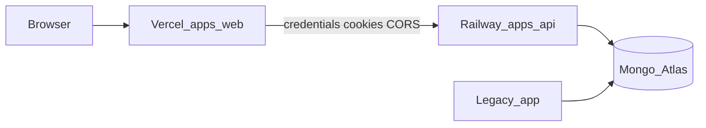
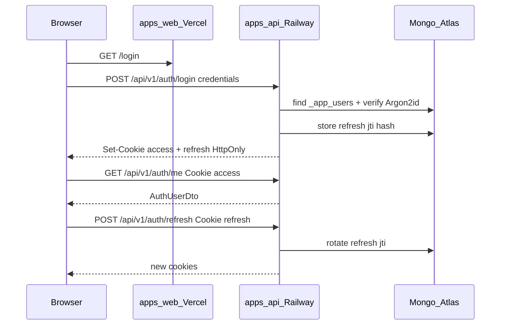

# Platform Roadmap: Auth + Deploy + Ops (post-foundation)

Дорожная карта **после** [`foundation-v1.0.0`](FOUNDATION-ROADMAP.md): закрыть инфраструктурные пробелы, ввести password-auth (JWT в httpOnly cookies), задеплоить API на **Railway**, web на **Vercel**, жить на **Mongo Atlas** рядом с legacy — и больше не возвращаться к вопросам инфры.

Предшественник: [FOUNDATION-ROADMAP.md](FOUNDATION-ROADMAP.md) (T0–T10, шаги 001–096). Этот файл — **единственный источник правды** для платформенного слоя T11–T25 (шаги **097–246**). Цель: тег **`platform-v1.0.0`**.

### Как пользоваться

1. Foundation должен быть закрыт (`foundation-v1.0.0`, [`track-foundation-acceptance.md`](track-foundation-acceptance.md)).
2. Выполняй шаги с **097** по порядку треков (или по [рекомендуемому потоку](#6-порядок-выполнения-треков)).
3. После каждого шага обновляй [Прогресс](#прогресс-обновляй-в-этом-репозитории): `todo` → `doing` → `done`.
4. В работе одновременно только **один** шаг в статусе `doing`.
5. Не открывай OAuth / RBAC UI / email magic-link — они в anti-goals.

---

## Содержание

1. [Цель и границы](#1-цель-и-границы)
2. [Целевая архитектура](#2-целевая-архитектура)
3. [Стек дополнений](#3-стек-дополнений)
4. [Auth: зафиксированные решения](#4-auth-зафиксированные-решения)
5. [Политики качества и ops](#5-политики-качества-и-ops)
6. [Порядок выполнения треков](#6-порядок-выполнения-треков)
7. [Track 11 — Repo Ops Freeze (097–104)](#track-11--repo-ops-freeze-097104)
8. [Track 12 — Environments & Secrets (105–114)](#track-12--environments--secrets-105114)
9. [Track 13 — Atlas & Network (115–122)](#track-13--atlas--network-115122)
10. [Track 14 — Auth Data & ADR (123–128)](#track-14--auth-data--adr-123128)
11. [Track 15 — Auth API (129–145)](#track-15--auth-api-129145)
12. [Track 16 — Auth Security Hardening (146–155)](#track-16--auth-security-hardening-146155)
13. [Track 17 — Auth Web (156–168)](#track-17--auth-web-156168)
14. [Track 18 — Feature Flags Skeleton (169–174)](#track-18--feature-flags-skeleton-169174)
15. [Track 19 — Quality Expansion (175–182)](#track-19--quality-expansion-175182)
16. [Track 20 — Observability Production (183–190)](#track-20--observability-production-183190)
17. [Track 21 — Railway API Deploy (191–205)](#track-21--railway-api-deploy-191205)
18. [Track 22 — Vercel Web Deploy (206–218)](#track-22--vercel-web-deploy-206218)
19. [Track 23 — Custom Domains & Cookie Prod (219–226)](#track-23--custom-domains--cookie-prod-219226)
20. [Track 24 — CI/CD Deploy Automation (227–236)](#track-24--cicd-deploy-automation-227236)
21. [Track 25 — Runbooks & Freeze (237–246)](#track-25--runbooks--freeze-237246)
22. [Ключевые архитектурные решения](#22-ключевые-архитектурные-решения)
23. [Deploy how-to (сводка)](#23-deploy-how-to-сводка)
24. [После platform: доменный продукт](#24-после-platform-доменный-продукт)
25. [Прогресс](#прогресс-обновляй-в-этом-репозитории)

---

## 1. Цель и границы

### Намерение

Построить **закрытый платформенный слой**, после которого команда думает о доменных фичах, а не об инфре:

- ops-гигиена репо (branch protection, Dependabot, CODEOWNERS);
- матрица окружений и секретов;
- Atlas рядом с legacy без prod URI в CI;
- login/password auth (свои users, путь к legacy later);
- JWT access + refresh в **httpOnly cookies**;
- API на Railway, web на Vercel, custom domains для prod cookies;
- Playwright login e2e, observability за флагом, runbooks deploy/rollback.

### «Платформа готова» (Track 25)

| Критерий                                     | Проверка                                                             |
| -------------------------------------------- | -------------------------------------------------------------------- |
| Staging API на Railway + Web на Vercel       | URL в [`track-platform-acceptance.md`](track-platform-acceptance.md) |
| Prod custom domains + cookies `SameSite=Lax` | login → me → logout                                                  |
| Atlas только через env; CI без prod URI      | docs + CI config                                                     |
| Auth e2e + Playwright login                  | CI green                                                             |
| Branch protection + Dependabot               | GitHub settings                                                      |
| OpenAPI drift + tests-first                  | без регресса foundation gates                                        |
| Runbooks deploy / rollback / secrets         | файлы в `docs/deploy/`, `docs/ops/`                                  |
| ADR-002 + ADR-003 приняты                    | `docs/adr/`                                                          |
| Tag `platform-v1.0.0`                        | CHANGELOG + remote tag                                               |

### Anti-goals (вне scope T11–T25)

- OAuth / social login / magic-link / email verification product.
- RBAC UI, роли, permissions matrix (заложить только «authenticated vs public»).
- Миграция на Postgres / смена БД.
- Dual-read/write с legacy `users` (только stub ADR-004 later).
- Microservice split, отдельный auth-service.
- Обязательный Sentry/Datadog vendor lock (OTel OTLP — optional behind flag).
- Write в legacy product collections (по-прежнему ADR + inventory).

---

## 2. Целевая архитектура



### Канонические артефакты (появятся по шагам)

```text
.
├── apps/
│   ├── api/
│   │   ├── Dockerfile
│   │   ├── railway.toml          # или root railway.toml
│   │   └── src/
│   │       ├── auth/
│   │       ├── users/
│   │       └── flags/
│   ├── web/                      # nitro() уже в vite.config
│   └── web-e2e/                  # Playwright (T19)
├── docs/
│   ├── PLATFORM-ROADMAP.md       # этот файл
│   ├── track-platform-acceptance.md
│   ├── adr/
│   │   ├── 002-auth-jwt-cookies.md
│   │   └── 003-app-users-collection.md
│   ├── deploy/
│   │   ├── README.md
│   │   ├── railway.md
│   │   └── vercel.md
│   └── ops/
│       ├── secrets-checklist.md
│       └── incident-rollback.md
├── .github/
│   ├── CODEOWNERS
│   ├── dependabot.yml
│   └── workflows/                # ci.yml + optional smoke
└── SECURITY.md
```

### Поток auth (reference)



---

## 3. Стек дополнений

Поверх foundation (Nest 11 + TanStack Start + Nx 22 + Mongo/Mongoose + Vitest 4):

| Слой          | Технология                                    | Notes                      |
| ------------- | --------------------------------------------- | -------------------------- |
| Password hash | Argon2id (`@node-rs/argon2` или `argon2`)     | never bcrypt for new users |
| JWT           | `@nestjs/jwt` + verified claims               | access ~15m, refresh ~7d   |
| Cookies       | `cookie-parser` + manual `Set-Cookie` helpers | HttpOnly Secure            |
| Rate limit    | `@nestjs/throttler`                           | stricter on `/auth/*`      |
| E2E browser   | Playwright                                    | login happy-path           |
| API image     | multi-stage Dockerfile                        | Railway                    |
| Web runtime   | Nitro (уже в web)                             | Vercel Fluid / Functions   |
| Deps updates  | Dependabot                                    | weekly npm + Actions       |
| Tracing       | OTel OTLP behind `OTEL_ENABLED`               | no required SaaS           |

**Правило:** явные semver в lock; секреты только в Railway/Vercel/GitHub Environments — не в git.

---

## 4. Auth: зафиксированные решения

| Тема            | Решение                                                                                                       |
| --------------- | ------------------------------------------------------------------------------------------------------------- |
| Users           | **1C** — коллекция `_app_users` (не legacy); inventory + ADR закладывают будущую dual-read с legacy `users`   |
| Session         | **JWT access + refresh в httpOnly cookies** (не localStorage; не server session store)                        |
| Register        | `AUTH_REGISTRATION_ENABLED=false` в prod; bootstrap CLI для первого admin                                     |
| CSRF            | Origin allowlist (= `WEB_ORIGIN` + preview list) на mutating methods; optional double-submit `csrf` cookie    |
| Preview cookies | cross-site `SameSite=None; Secure` только для `*.vercel.app` ↔ Railway preview                                |
| Prod cookies    | **обязательны custom domains** `app.` + `api.` на одном parent → `SameSite=Lax`, `COOKIE_DOMAIN=.example.com` |

### Cookie shape

| Cookie            | TTL     | Path           | Notes                                       |
| ----------------- | ------- | -------------- | ------------------------------------------- |
| `access_token`    | ~15m    | `/`            | short-lived JWT                             |
| `refresh_token`   | ~7d     | `/api/v1/auth` | rotation; jti hash in `_app_refresh_tokens` |
| `csrf` (optional) | session | `/`            | not HttpOnly if double-submit               |

### Endpoints (под `/api/v1`)

| Method | Path             | Auth              | Notes                       |
| ------ | ---------------- | ----------------- | --------------------------- |
| POST   | `/auth/register` | public            | only if flag                |
| POST   | `/auth/login`    | public            | sets cookies                |
| POST   | `/auth/logout`   | refresh or access | clears cookies + revoke jti |
| POST   | `/auth/refresh`  | refresh cookie    | rotate                      |
| GET    | `/auth/me`       | access cookie     | AuthUserDto                 |

`/health`, `/health/ready`, `/api/docs` — `@Public()`. Policy для `/api/v1/examples/*` — явно в ADR-002 (foundation demo: public или authenticated — зафиксировать **authenticated write, public read** или оба public до первого домена; default в этом roadmap: **GET public, POST authenticated**).

---

## 5. Политики качества и ops

Все gates foundation остаются обязательными (`tests-first`, `npm run ci`, OpenAPI drift, coverage thresholds).

### Дополнения платформы

1. Coverage include расширяется на `auth/`, `users/`, cookie helpers, guards (T19).
2. Playwright login — отдельный CI job (не блокирует windows matrix; ubuntu).
3. Staging/prod Atlas DB names **разные**; CI — только `mongo:7` service / local docker.
4. Branch protection must be **enabled in GitHub**, не только документирован.
5. Deploy default: **Vercel Git integration** + **Railway GitHub deploy**; optional smoke workflow.

### Definition of Done (любой шаг)

1. Код + тесты в одном changeset (если шаг кодовый).
2. `npm run ci` / affected green.
3. `.env.example` + deploy docs при новых env.
4. Шаг отмечен в [Прогресс](#прогресс-обновляй-в-этом-репозитории).

---

## 6. Порядок выполнения треков

```text
T11 Ops freeze          → процессные дыры
T12 Env & secrets       → матрица окружений
T13 Atlas & network     → inventory + connection policy
T14 Auth ADR + contracts
T15 Auth API
T16 Auth security
T17 Auth web
T18 Feature flags
T19 Quality + Playwright
T20 Observability prod
T21 Railway API
T22 Vercel web
T23 Custom domains      → prod cookie profile
T24 Deploy automation
T25 Acceptance + tag platform-v1.0.0
```

**Не начинать T21/T22 без зелёного auth e2e (T15–T16) локально.**  
**Не считать platform done без T23 custom domains** (preview SameSite=None — только interim).

---

## Track 11 — Repo Ops Freeze (097–104)

| Step | Title                  | Что создать                                                                                            | Verification                        | DoD                         | Тесты |
| ---- | ---------------------- | ------------------------------------------------------------------------------------------------------ | ----------------------------------- | --------------------------- | ----- |
| 097  | Branch protection live | обновить [`docs/branch-protection.md`](branch-protection.md): чеклист + дата включения required checks | GitHub Settings показывает 3 checks | merges blocked without CI   | —     |
| 098  | CODEOWNERS             | `.github/CODEOWNERS` для `apps/`, `libs/`, `.github/`, `docs/adr/`                                     | PR requests review                  | owners resolve              | —     |
| 099  | Dependabot             | `.github/dependabot.yml` (npm weekly + github-actions)                                                 | Dependabot PRs appear               | config valid                | —     |
| 100  | SECURITY.md            | root `SECURITY.md` (how to report)                                                                     | review                              | linked from README          | —     |
| 101  | Tag remote policy      | push `foundation-v1.0.0` if missing; doc tag rules in CHANGELOG header                                 | `git ls-remote --tags`              | remote tag exists           | —     |
| 102  | Coverage policy note   | секция в [`docs/testing.md`](testing.md): expand include on platform modules                           | review                              | policy written              | —     |
| 103  | Incident rollback stub | [`docs/ops/incident-rollback.md`](ops/incident-rollback.md)                                            | review                              | Railway/Vercel revert steps | —     |
| 104  | T11 checklist          | короткий `docs/track-11-ops-freeze.md` или секция в acceptance                                         | all 097–103 done                    | track closed                | —     |

---

## Track 12 — Environments & Secrets (105–114)

| Step | Title                   | Что создать                                                                                                                                                      | Verification             | DoD                          | Тесты                |
| ---- | ----------------------- | ---------------------------------------------------------------------------------------------------------------------------------------------------------------- | ------------------------ | ---------------------------- | -------------------- |
| 105  | Env matrix doc          | [`docs/ops/environments.md`](ops/environments.md): local / preview / staging / production                                                                        | review                   | 4 envs defined               | —                    |
| 106  | API env Zod expand      | `JWT_ACCESS_SECRET`, `JWT_REFRESH_SECRET`, `COOKIE_DOMAIN`, `AUTH_COOKIE_SAMESITE`, `AUTH_REGISTRATION_ENABLED`, `TRUST_PROXY`, `OTEL_ENABLED` (+ optional OTLP) | `nx run api:test`        | schema fail-fast             | `env.schema.spec.ts` |
| 107  | Web env policy          | только публичные `VITE_*`; doc «secrets never in Vite»                                                                                                           | review                   | LOCAL_SETUP updated          | `env.schema.spec.ts` |
| 108  | `.env.example` sync     | root + `apps/api` + `apps/web` placeholders (no real secrets)                                                                                                    | diff review              | examples complete            | —                    |
| 109  | Secrets checklist       | [`docs/ops/secrets-checklist.md`](ops/secrets-checklist.md)                                                                                                      | review                   | Railway/Vercel/GitHub listed | —                    |
| 110  | Atlas DB naming         | convention: `app_foundation_dev`, `app_staging`, `app_prod` (или эквивалент)                                                                                     | doc                      | CI never uses prod name      | —                    |
| 111  | Preview origins         | `WEB_ORIGIN` + optional `WEB_ORIGIN_PREVIEW_REGEX` / list for Vercel previews                                                                                    | unit                     | CORS plan written            | cors spec update     |
| 112  | TRUST_PROXY doc         | Railway requires `TRUST_PROXY=1` for Secure cookies                                                                                                              | LOCAL_SETUP + deploy doc | noted                        | —                    |
| 113  | Secret rotation runbook | paragraph in secrets-checklist (JWT secrets rotate → invalidate sessions)                                                                                        | review                   | procedure exists             | —                    |
| 114  | T12 freeze              | progress update                                                                                                                                                  | all 105–113 done         | track closed                 | —                    |

---

## Track 13 — Atlas & Network (115–122)

| Step | Title                           | Что создать                                                                                              | Verification       | DoD                     | Тесты |
| ---- | ------------------------------- | -------------------------------------------------------------------------------------------------------- | ------------------ | ----------------------- | ----- |
| 115  | Atlas connection policy         | секция в [`docs/deploy/atlas.md`](deploy/atlas.md): URI params (`retryWrites`, `appName`), no prod in CI | review             | doc exists              | —     |
| 116  | Network access                  | Atlas IP allowlist / Railway egress notes; 0.0.0.0/0 только если unavoidable + risk note                 | review             | staging+prod documented | —     |
| 117  | Inventory `_app_users`          | строка в [`docs/data/collections-inventory.md`](data/collections-inventory.md)                           | review             | mode read/write new API | —     |
| 118  | Inventory `_app_refresh_tokens` | TTL / indexes note                                                                                       | review             | inventory updated       | —     |
| 119  | Legacy `users` row              | keep `read-only until ADR-004`; no new-app write                                                         | review             | ADR-001 consistent      | —     |
| 120  | Index policy app collections    | unique email/username on `_app_users`; jti unique on refresh                                             | doc + later schema | policy clear            | —     |
| 121  | Readiness timeout note          | document Mongo ping failure → 503; boot fail-fast optional                                               | health docs        | ops clear               | —     |
| 122  | T13 freeze                      | progress                                                                                                 | 115–121 done       | track closed            | —     |

---

## Track 14 — Auth Data & ADR (123–128)

| Step | Title                | Что создать                                                               | Verification                   | DoD             | Тесты      |
| ---- | -------------------- | ------------------------------------------------------------------------- | ------------------------------ | --------------- | ---------- |
| 123  | ADR-002 JWT cookies  | [`docs/adr/002-auth-jwt-cookies.md`](adr/002-auth-jwt-cookies.md)         | review                         | Accepted        | —          |
| 124  | ADR-003 app users    | [`docs/adr/003-app-users-collection.md`](adr/003-app-users-collection.md) | review                         | Accepted        | —          |
| 125  | ADR-004 stub pointer | short «Future: legacy users dual-read» in ADR-003 or stub file            | review                         | not implemented | —          |
| 126  | Contracts auth DTOs  | Zod: Login, Register, AuthUser; error URIs                                | `nx run shared-contracts:test` | exported        | unit specs |
| 127  | Problem Details auth | unauthorized / forbidden / rate-limited fixtures if needed                | contracts tests                | golden OK       | fixtures   |
| 128  | T14 freeze           | OpenAPI stub types planned                                                | 123–127 done                   | track closed    | —          |

---

## Track 15 — Auth API (129–145)

| Step | Title                      | Что создать                                                            | Verification    | DoD                          | Тесты         |
| ---- | -------------------------- | ---------------------------------------------------------------------- | --------------- | ---------------------------- | ------------- |
| 129  | UsersModule schema         | `_app_users` Mongoose schema + unique indexes                          | unit            | collection name exact        | schema spec   |
| 130  | RefreshToken schema        | `_app_refresh_tokens` + TTL index optional                             | unit            | jti hash stored              | schema spec   |
| 131  | Argon2id service           | hash + verify wrappers                                                 | unit            | timing-safe verify           | password.spec |
| 132  | Jwt module config          | access/refresh secrets + expires from env                              | boot            | fail without secrets in prod | config spec   |
| 133  | Cookie helpers             | `setAuthCookies` / `clearAuthCookies` (Domain, SameSite, Secure, Path) | unit            | flags correct                | cookies.spec  |
| 134  | AuthService login/register | create user, issue tokens, store refresh                               | unit            | no password in logs          | service.spec  |
| 135  | AuthService refresh/logout | rotate + revoke                                                        | unit            | reuse detection optional     | service.spec  |
| 136  | AuthController             | routes + Swagger DTOs                                                  | e2e             | Problem Details on 401       | e2e           |
| 137  | JwtAuthGuard + `@Public()` | global APP_GUARD                                                       | e2e             | public health works          | guard.spec    |
| 138  | GET `/auth/me`             | current user                                                           | e2e             | 401 without cookie           | e2e           |
| 139  | Examples POST auth         | enforce ADR-002 policy on POST                                         | e2e             | 401 without auth             | e2e           |
| 140  | Bootstrap admin CLI        | `nx run api:bootstrap-admin` / script                                  | manual local    | first user created           | —             |
| 141  | Register behind flag       | 404/403 when disabled                                                  | e2e             | flag respected               | e2e           |
| 142  | OpenAPI export auth        | paths in openapi.json                                                  | `openapi:check` | drift green                  | —             |
| 143  | Web client types regen     | `openapi:generate`                                                     | compile         | types used later             | —             |
| 144  | Auth e2e suite             | login/refresh/logout/me full flow                                      | `test:api:e2e`  | green with mongo             | e2e           |
| 145  | T15 freeze                 | checklist in progress                                                  | 129–144 done    | track closed                 | —             |

---

## Track 16 — Auth Security Hardening (146–155)

| Step | Title                   | Что создать                                              | Verification | DoD                       | Тесты       |
| ---- | ----------------------- | -------------------------------------------------------- | ------------ | ------------------------- | ----------- |
| 146  | Throttler global + auth | `@nestjs/throttler`; stricter `/auth/login`              | e2e 429      | Problem Details           | e2e         |
| 147  | Login lockout           | failedAttempts + lockedUntil fields                      | unit + e2e   | generic error msg         | specs       |
| 148  | Generic auth errors     | never leak «user not found» vs bad password              | e2e          | same 401 body             | e2e         |
| 149  | CSRF Origin middleware  | allowlist WEB_ORIGIN(+previews) on POST/PUT/PATCH/DELETE | e2e          | bad Origin → 403          | e2e         |
| 150  | Optional CSRF cookie    | double-submit if needed for defense in depth             | unit         | documented                | spec        |
| 151  | TRUST_PROXY wiring      | `app.set('trust proxy', 1)` when env set                 | unit         | Secure cookies OK         | spec        |
| 152  | No tokens in JSON       | login response body without access/refresh strings       | e2e          | cookies only              | e2e         |
| 153  | Redact auth fields      | pino redact password, tokens, Authorization              | unit         | absent in logs            | logger spec |
| 154  | Security test suite     | cookie flags Secure/HttpOnly/SameSite                    | e2e          | matrix local+prod profile | e2e         |
| 155  | T16 freeze              | security notes in ADR-002                                | 146–154 done | track closed              | —           |

---

## Track 17 — Auth Web (156–168)

| Step | Title                  | Что создать                                        | Verification | DoD                   | Тесты       |
| ---- | ---------------------- | -------------------------------------------------- | ------------ | --------------------- | ----------- |
| 156  | Fetch credentials      | api client `credentials: 'include'`                | unit         | default on            | client test |
| 157  | Auth API module        | login/logout/refresh/me typed via openapi-fetch    | unit         | Zod parse             | tests       |
| 158  | `/login` route         | TanStack Form email/username + password            | RTL          | validation UX         | route test  |
| 159  | Login mutation         | set cookies via API; redirect                      | RTL          | error Problem Details | test        |
| 160  | `/logout` route/action | call logout + clear client state                   | RTL          | redirects home        | test        |
| 161  | `requireAuth` helper   | loader/beforeLoad redirect to `/login`             | RTL          | protects routes       | test        |
| 162  | Protect write routes   | `/examples/new` requires auth                      | RTL          | redirect              | test        |
| 163  | Root `/auth/me`        | context/provider for current user                  | RTL          | SSR-safe              | test        |
| 164  | 401 handling           | global client: redirect login on 401 for protected | unit         | no loop on login      | test        |
| 165  | 429 handling           | show rate-limit message                            | RTL          | copy OK               | test        |
| 166  | Nav auth UI            | login/logout links in shell                        | RTL          | states                | test        |
| 167  | LOCAL_SETUP auth       | how to bootstrap admin + login locally             | review       | newcomer path         | —           |
| 168  | T17 freeze             | web build + tests green                            | 156–167 done | track closed          | —           |

---

## Track 18 — Feature Flags Skeleton (169–174)

| Step | Title                       | Что создать                                         | Verification | DoD                 | Тесты      |
| ---- | --------------------------- | --------------------------------------------------- | ------------ | ------------------- | ---------- |
| 169  | FlagsModule                 | read env flags into typed config                    | unit         | inject OK           | flags.spec |
| 170  | `AUTH_REGISTRATION_ENABLED` | wire to register controller                         | e2e          | already T15; harden | e2e        |
| 171  | `ALLOW_LEGACY_WRITE_*` stub | parser + default false; no writers yet              | unit         | ADR-001 aligned     | spec       |
| 172  | Flags doc                   | [`docs/ops/feature-flags.md`](ops/feature-flags.md) | review       | no LaunchDarkly     | —          |
| 173  | .env.example flags          | examples for local                                  | review       | documented          | —          |
| 174  | T18 freeze                  | progress                                            | 169–173 done | track closed        | —          |

---

## Track 19 — Quality Expansion (175–182)

| Step | Title                    | Что создать                                                  | Verification               | DoD                                                         | Тесты      |
| ---- | ------------------------ | ------------------------------------------------------------ | -------------------------- | ----------------------------------------------------------- | ---------- |
| 175  | API coverage include     | expand vitest coverage include: auth, users, guards, cookies | `nx run api:test`          | thresholds hold                                             | coverage   |
| 176  | Web coverage include     | auth client + requireAuth helpers                            | `nx run web:test`          | thresholds hold                                             | coverage   |
| 177  | Playwright scaffold      | `apps/web-e2e` (or `apps/web` e2e config)                    | `nx run web-e2e:e2e` smoke | project exists                                              | —          |
| 178  | Login e2e spec           | bootstrap user → login → see me / protected page             | local compose              | green                                                       | playwright |
| 179  | testing.md Playwright    | document how to run                                          | review                     | linked README                                               | —          |
| 180  | CI Playwright job        | ubuntu job; mongo + api + web or staging URL                 | GHA green                  | required or informative (doc choice: **required for main**) | GHA        |
| 181  | branch-protection update | add Playwright check name if required                        | settings                   | documented                                                  | —          |
| 182  | T19 freeze               | progress                                                     | 175–181 done               | track closed                                                | —          |

---

## Track 20 — Observability Production (183–190)

| Step | Title                  | Что создать                                                         | Verification                                  | DoD               | Тесты       |
| ---- | ---------------------- | ------------------------------------------------------------------- | --------------------------------------------- | ----------------- | ----------- |
| 183  | Prod pino levels       | info default prod; debug local                                      | unit                                          | JSON lines        | logger spec |
| 184  | Railway logs doc       | how to read logs / retain                                           | [`docs/deploy/railway.md`](deploy/railway.md) | section exists    | —           |
| 185  | OTEL flag wiring       | replace noop when `OTEL_ENABLED=true` + endpoint                    | unit                                          | noop when false   | otel spec   |
| 186  | OTLP exporter optional | `@opentelemetry/sdk-node` behind flag                               | boot                                          | no crash if unset | spec        |
| 187  | Trace request id       | ensure request-id correlates (already middleware)                   | e2e optional                                  | doc               | —           |
| 188  | Alerting stub          | [`docs/ops/alerting.md`](ops/alerting.md): Sentry = future optional | review                                        | anti-goal clear   | —           |
| 189  | Redact audit           | confirm JWT/cookie values redacted                                  | unit                                          | pass              | logger spec |
| 190  | T20 freeze             | progress                                                            | 183–189 done                                  | track closed      | —           |

---

## Track 21 — Railway API Deploy (191–205)

| Step | Title                 | Что создать                                                                              | Verification           | DoD                | Тесты |
| ---- | --------------------- | ---------------------------------------------------------------------------------------- | ---------------------- | ------------------ | ----- |
| 191  | API Dockerfile        | multi-stage: root `npm ci` → build api → `node dist/main.js`                             | `docker build`         | image runs locally | —     |
| 192  | `.dockerignore`       | root/app ignore node_modules correctly                                                   | build context small    | documented         | —     |
| 193  | `railway.toml`        | healthcheck path `/health`, restart policy                                               | Railway validate       | file committed     | —     |
| 194  | Deploy doc Railway    | [`docs/deploy/railway.md`](deploy/railway.md): service create, root dir, Dockerfile path | review                 | copy-pasteable     | —     |
| 195  | Env mapping table     | every API env → Railway variable                                                         | secrets-checklist sync | complete           | —     |
| 196  | Staging service       | Railway staging + Atlas staging DB                                                       | curl health            | URL recorded       | —     |
| 197  | Atlas network Railway | allow Railway IPs / documented approach                                                  | ready 200              | staging ready      | —     |
| 198  | Staging smoke         | `/health`, `/health/ready`, login smoke                                                  | script/curl            | pass               | —     |
| 199  | Production service    | separate Railway prod service                                                            | health                 | URL recorded       | —     |
| 200  | Prod secrets          | JWT secrets length ≥32; distinct from staging                                            | checklist              | signed off         | —     |
| 201  | Graceful shutdown     | confirm SIGTERM on Railway (already Nest hooks)                                          | deploy notes           | verified once      | —     |
| 202  | Rollback procedure    | link incident-rollback Railway redeploy                                                  | dry-run note           | documented         | —     |
| 203  | Monorepo build args   | ensure workspace `@app/shared-contracts` in image                                        | boot                   | no missing module  | —     |
| 204  | PORT binding          | listen `process.env.PORT` (Railway injects)                                              | already Zod PORT       | confirmed          | —     |
| 205  | T21 freeze            | staging+prod API live                                                                    | 191–204 done           | track closed       | —     |

---

## Track 22 — Vercel Web Deploy (206–218)

| Step | Title                  | Что создать                                                                                                             | Verification      | DoD               | Тесты  |
| ---- | ---------------------- | ----------------------------------------------------------------------------------------------------------------------- | ----------------- | ----------------- | ------ |
| 206  | Nitro confirm          | `nitro()` in [`apps/web/vite.config.ts`](../apps/web/vite.config.ts) (already present)                                  | build             | no change if OK   | smoke  |
| 207  | Vercel project doc     | [`docs/deploy/vercel.md`](deploy/vercel.md)                                                                             | review            | monorepo settings | —      |
| 208  | Monorepo install       | Root Directory / Install Command: `npm ci` from repo root; Build: `npx nx run web:build` or `npm run build -w @app/web` | Vercel build log  | success           | —      |
| 209  | Framework preset       | `tanstack-start` (dashboard or `vercel project update`)                                                                 | detect OK         | documented        | —      |
| 210  | `VITE_API_URL` staging | points to Railway staging API                                                                                           | preview           | login works       | —      |
| 211  | CORS WEB_ORIGIN        | Railway `WEB_ORIGIN` = Vercel staging URL                                                                               | preflight         | credentials OK    | —      |
| 212  | Preview SameSite       | `AUTH_COOKIE_SAMESITE=none` on API for preview only                                                                     | login cross-site  | interim OK        | manual |
| 213  | Production web project | separate prod Vercel env                                                                                                | deploy            | URL recorded      | —      |
| 214  | SSR smoke prod         | home + login render                                                                                                     | curl/browser      | 200               | —      |
| 215  | Env sync checklist     | Vercel envs ↔ docs                                                                                                      | secrets-checklist | complete          | —      |
| 216  | Vercel Git integration | auto deploy on `main` / PR previews                                                                                     | PR preview URL    | enabled           | —      |
| 217  | Rollback Vercel        | promote previous / revert                                                                                               | incident-rollback | documented        | —      |
| 218  | T22 freeze             | staging web↔api auth works                                                                                              | 206–217 done      | track closed      | —      |

---

## Track 23 — Custom Domains & Cookie Prod (219–226)

| Step | Title             | Что создать                                                                          | Verification         | DoD                          | Тесты      |
| ---- | ----------------- | ------------------------------------------------------------------------------------ | -------------------- | ---------------------------- | ---------- |
| 219  | Domain plan       | pick parent domain; `app.` → Vercel, `api.` → Railway                                | DNS docs             | recorded in deploy README    | —          |
| 220  | DNS + TLS         | configure both platforms                                                             | browser padlock      | HTTPS only                   | —          |
| 221  | COOKIE_DOMAIN     | `.example.com` on API prod                                                           | login                | cookies visible for API host | manual     |
| 222  | SameSite=Lax prod | disable None profile on prod                                                         | ADR-002 prod section | Lax active                   | e2e/manual |
| 223  | CORS prod origin  | `WEB_ORIGIN=https://app.example.com` exact                                           | preflight            | no `*`                       | —          |
| 224  | HSTS note         | document (Railway/Vercel/CDN)                                                        | ops doc              | noted                        | —          |
| 225  | Cutover checklist | preview → prod cookies ([`docs/deploy/cookie-cutover.md`](deploy/cookie-cutover.md)) | review               | signed off                   | —          |
| 226  | T23 freeze        | prod login→me→logout on custom domains                                               | 219–225 done         | track closed                 | —          |

---

## Track 24 — CI/CD Deploy Automation (227–236)

| Step | Title                               | Что создать                                                  | Verification                                | DoD             | Тесты |
| ---- | ----------------------------------- | ------------------------------------------------------------ | ------------------------------------------- | --------------- | ----- |
| 227  | Deploy strategy doc                 | default: Vercel Git + Railway GitHub; optional Actions smoke | [`docs/deploy/README.md`](deploy/README.md) | decision locked | —     |
| 228  | GitHub Environment staging          | secrets + URL                                                | settings                                    | exists          | —     |
| 229  | GitHub Environment production       | required reviewers                                           | settings                                    | protected       | —     |
| 230  | Post-deploy smoke workflow          | `workflow_dispatch` + on staging deploy: curl health         | GHA                                         | green           | —     |
| 231  | Optional Playwright against staging | nightly or post-deploy                                       | GHA                                         | documented      | —     |
| 232  | Railway watch branch                | `main` → staging; tag/manual → prod (doc exact)              | dashboard                                   | matches doc     | —     |
| 233  | Vercel prod branch                  | `main` → production                                          | dashboard                                   | matches doc     | —     |
| 234  | No prod secrets in Actions logs     | mask + docs                                                  | review                                      | policy          | —     |
| 235  | Deploy permissions                  | least privilege tokens                                       | review                                      | documented      | —     |
| 236  | T24 freeze                          | automation path verified once                                | 227–235 done                                | track closed    | —     |

---

## Track 25 — Runbooks & Freeze (237–246)

| Step | Title                 | Что создать                                                                     | Verification   | DoD                        | Тесты |
| ---- | --------------------- | ------------------------------------------------------------------------------- | -------------- | -------------------------- | ----- |
| 237  | Deploy index          | [`docs/deploy/README.md`](deploy/README.md) links railway/vercel/atlas/cookies  | review         | index complete             | —     |
| 238  | Platform acceptance   | fill [`docs/track-platform-acceptance.md`](track-platform-acceptance.md) all ✅ | checklist      | criteria met               | —     |
| 239  | README links          | root README → PLATFORM-ROADMAP + deploy                                         | review         | discoverable               | —     |
| 240  | LOCAL_SETUP prod note | point to deploy docs; local still docker mongo                                  | review         | clear                      | —     |
| 241  | CHANGELOG entry       | `platform-v1.0.0` section                                                       | review         | written                    | —     |
| 242  | Anti-goals confirm    | listed in acceptance                                                            | review         | no scope creep             | —     |
| 243  | Domain recipe pointer | after platform, use [`domain-module-recipe.md`](domain-module-recipe.md)        | review         | linked                     | —     |
| 244  | Tag `platform-v1.0.0` | annotated tag                                                                   | `git show`     | local tag                  | —     |
| 245  | Push tag              | `git push origin platform-v1.0.0`                                               | ls-remote      | remote                     | —     |
| 246  | Progress close        | all T11–T25 `done` in this file                                                 | progress table | foundation+platform frozen | —     |

---

## 22. Ключевые архитектурные решения

| Решение                              | Почему                                                       | Альтернатива отклонена       |
| ------------------------------------ | ------------------------------------------------------------ | ---------------------------- |
| App-owned `_app_users` (1C)          | нет риска сломать legacy hash/schema; путь к dual-read позже | login сразу в legacy `users` |
| JWT cookies (не Bearer localStorage) | XSS не читает token; SSR-friendly credentials                | localStorage JWT             |
| Refresh rotation + jti store         | revoke/logout real; reuse detection possible                 | stateless refresh only       |
| Argon2id                             | modern password hashing                                      | bcrypt-only                  |
| Origin CSRF allowlist                | cross-origin Vercel↔Railway safe enough with cookies         | skip CSRF                    |
| Custom domains for prod              | SameSite=Lax monorepo-grade                                  | вечный SameSite=None         |
| Railway + Vercel                     | API long-running Node; web SSR on Vercel/Nitro               | всё на одном PaaS            |
| Env feature flags                    | zero vendor; enough for registration/legacy writes           | LaunchDarkly now             |
| OTel behind flag                     | hook without forcing vendor                                  | always-on SaaS SDK           |

---

## 23. Deploy how-to (сводка)

Полные runbooks появляются в шагах T21–T23. Краткая памятка:

### Mongo Atlas

1. Отдельные DB (или users) для staging vs production.
2. `MONGODB_URI` только в Railway (и local `.env`); никогда в Vercel `VITE_*`.
3. CI продолжает использовать GitHub `mongo:7` service — **не** Atlas prod.

### Railway (`apps/api`)

1. New service from GitHub repo; Dockerfile at `apps/api/Dockerfile` (build context repo root).
2. Healthcheck: `GET /health` (liveness); ready separately via `/health/ready`.
3. Variables: полный список из `docs/ops/secrets-checklist.md` + `docs/deploy/railway.md`.
4. `TRUST_PROXY=1`, `PORT` provided by Railway, `WEB_ORIGIN` = web URL.
5. Staging и Production — **два сервиса**.

### Vercel (`apps/web`)

1. Import monorepo; framework **TanStack Start**; `nitro()` already in Vite config.
2. Install from repo root; build web workspace / `nx run web:build`.
3. `VITE_API_URL=https://api.<domain>` (staging/prod respectively).
4. Git integration: PR previews + production on `main`.
5. No API secrets on Vercel.

### Custom domains (prod)

1. `app.example.com` → Vercel; `api.example.com` → Railway.
2. API: `COOKIE_DOMAIN=.example.com`, `AUTH_COOKIE_SAMESITE=lax`, `WEB_ORIGIN=https://app.example.com`.
3. Verify: login sets cookies; `/auth/me` works; logout clears.

### Default automation

- **Vercel**: GitHub integration (previews + prod).
- **Railway**: GitHub deploy on `main` → staging; prod promote per runbook.
- **Optional**: GitHub Actions smoke (`curl` health) after deploy.

---

## 24. После platform: доменный продукт

1. Первый legacy read-only модуль — [`domain-module-recipe.md`](domain-module-recipe.md).
2. Writes в legacy — новый ADR + `ALLOW_LEGACY_WRITE_*` + inventory.
3. Связка `_app_users` ↔ legacy `users` — **ADR-004** (вне этого roadmap).
4. OAuth / RBAC / email — отдельные roadmap’ы после `platform-v1.0.0`.

---

## Прогресс (обновляй в этом репозитории)

Статусы шага: `todo` → `doing` → `done`. Статусы трека: `todo` → `doing` → `done`.

### Текущий этап

| Поле             | Значение                  |
| ---------------- | ------------------------- |
| Трек             | **T11 — Repo Ops Freeze** |
| Текущий шаг      | **098** — CODEOWNERS      |
| Статус шага      | `todo`                    |
| Последний `done` | **097**                   |
| Закрыто шагов    | **1 / 150** (097–246)     |
| Обновлено        | 2026-07-22                |

### Сводка по трекам

| Track                 | Steps   | Done | Status  |
| --------------------- | ------- | ---- | ------- |
| T11 Repo ops          | 097–104 | 1    | `doing` |
| T12 Env & secrets     | 105–114 | 0    | `todo`  |
| T13 Atlas & network   | 115–122 | 0    | `todo`  |
| T14 Auth data & ADR   | 123–128 | 0    | `todo`  |
| T15 Auth API          | 129–145 | 0    | `todo`  |
| T16 Auth security     | 146–155 | 0    | `todo`  |
| T17 Auth web          | 156–168 | 0    | `todo`  |
| T18 Feature flags     | 169–174 | 0    | `todo`  |
| T19 Quality expansion | 175–182 | 0    | `todo`  |
| T20 Observability     | 183–190 | 0    | `todo`  |
| T21 Railway API       | 191–205 | 0    | `todo`  |
| T22 Vercel web        | 206–218 | 0    | `todo`  |
| T23 Custom domains    | 219–226 | 0    | `todo`  |
| T24 CI/CD deploy      | 227–236 | 0    | `todo`  |
| T25 Runbooks & freeze | 237–246 | 0    | `todo`  |

### Чеклист шагов

#### T11 — Repo Ops Freeze (097–104)

| Step | Title                  | Status | Notes                                                                                         |
| ---- | ---------------------- | ------ | --------------------------------------------------------------------------------------------- |
| 097  | Branch protection live | `done` | Enabled 2026-07-22 on public repo; see [`branch-protection.md`](branch-protection.md)#enabled |
| 098  | CODEOWNERS             | `todo` |                                                                                               |
| 099  | Dependabot             | `todo` |                                                                                               |
| 100  | SECURITY.md            | `todo` |                                                                                               |
| 101  | Tag remote policy      | `todo` |                                                                                               |
| 102  | Coverage policy note   | `todo` |                                                                                               |
| 103  | Incident rollback stub | `todo` |                                                                                               |
| 104  | T11 checklist          | `todo` |                                                                                               |

#### T12 — Environments & Secrets (105–114)

| Step | Title                   | Status | Notes |
| ---- | ----------------------- | ------ | ----- |
| 105  | Env matrix doc          | `todo` |       |
| 106  | API env Zod expand      | `todo` |       |
| 107  | Web env policy          | `todo` |       |
| 108  | `.env.example` sync     | `todo` |       |
| 109  | Secrets checklist       | `todo` |       |
| 110  | Atlas DB naming         | `todo` |       |
| 111  | Preview origins         | `todo` |       |
| 112  | TRUST_PROXY doc         | `todo` |       |
| 113  | Secret rotation runbook | `todo` |       |
| 114  | T12 freeze              | `todo` |       |

#### T13 — Atlas & Network (115–122)

| Step | Title                           | Status | Notes |
| ---- | ------------------------------- | ------ | ----- |
| 115  | Atlas connection policy         | `todo` |       |
| 116  | Network access                  | `todo` |       |
| 117  | Inventory `_app_users`          | `todo` |       |
| 118  | Inventory `_app_refresh_tokens` | `todo` |       |
| 119  | Legacy `users` row              | `todo` |       |
| 120  | Index policy app collections    | `todo` |       |
| 121  | Readiness timeout note          | `todo` |       |
| 122  | T13 freeze                      | `todo` |       |

#### T14 — Auth Data & ADR (123–128)

| Step | Title                | Status | Notes |
| ---- | -------------------- | ------ | ----- |
| 123  | ADR-002 JWT cookies  | `todo` |       |
| 124  | ADR-003 app users    | `todo` |       |
| 125  | ADR-004 stub pointer | `todo` |       |
| 126  | Contracts auth DTOs  | `todo` |       |
| 127  | Problem Details auth | `todo` |       |
| 128  | T14 freeze           | `todo` |       |

#### T15 — Auth API (129–145)

| Step | Title                      | Status | Notes |
| ---- | -------------------------- | ------ | ----- |
| 129  | UsersModule schema         | `todo` |       |
| 130  | RefreshToken schema        | `todo` |       |
| 131  | Argon2id service           | `todo` |       |
| 132  | Jwt module config          | `todo` |       |
| 133  | Cookie helpers             | `todo` |       |
| 134  | AuthService login/register | `todo` |       |
| 135  | AuthService refresh/logout | `todo` |       |
| 136  | AuthController             | `todo` |       |
| 137  | JwtAuthGuard + `@Public()` | `todo` |       |
| 138  | GET `/auth/me`             | `todo` |       |
| 139  | Examples POST auth         | `todo` |       |
| 140  | Bootstrap admin CLI        | `todo` |       |
| 141  | Register behind flag       | `todo` |       |
| 142  | OpenAPI export auth        | `todo` |       |
| 143  | Web client types regen     | `todo` |       |
| 144  | Auth e2e suite             | `todo` |       |
| 145  | T15 freeze                 | `todo` |       |

#### T16 — Auth Security Hardening (146–155)

| Step | Title                   | Status | Notes |
| ---- | ----------------------- | ------ | ----- |
| 146  | Throttler global + auth | `todo` |       |
| 147  | Login lockout           | `todo` |       |
| 148  | Generic auth errors     | `todo` |       |
| 149  | CSRF Origin middleware  | `todo` |       |
| 150  | Optional CSRF cookie    | `todo` |       |
| 151  | TRUST_PROXY wiring      | `todo` |       |
| 152  | No tokens in JSON       | `todo` |       |
| 153  | Redact auth fields      | `todo` |       |
| 154  | Security test suite     | `todo` |       |
| 155  | T16 freeze              | `todo` |       |

#### T17 — Auth Web (156–168)

| Step | Title                  | Status | Notes |
| ---- | ---------------------- | ------ | ----- |
| 156  | Fetch credentials      | `todo` |       |
| 157  | Auth API module        | `todo` |       |
| 158  | `/login` route         | `todo` |       |
| 159  | Login mutation         | `todo` |       |
| 160  | `/logout` route/action | `todo` |       |
| 161  | `requireAuth` helper   | `todo` |       |
| 162  | Protect write routes   | `todo` |       |
| 163  | Root `/auth/me`        | `todo` |       |
| 164  | 401 handling           | `todo` |       |
| 165  | 429 handling           | `todo` |       |
| 166  | Nav auth UI            | `todo` |       |
| 167  | LOCAL_SETUP auth       | `todo` |       |
| 168  | T17 freeze             | `todo` |       |

#### T18 — Feature Flags Skeleton (169–174)

| Step | Title                       | Status | Notes |
| ---- | --------------------------- | ------ | ----- |
| 169  | FlagsModule                 | `todo` |       |
| 170  | `AUTH_REGISTRATION_ENABLED` | `todo` |       |
| 171  | `ALLOW_LEGACY_WRITE_*` stub | `todo` |       |
| 172  | Flags doc                   | `todo` |       |
| 173  | .env.example flags          | `todo` |       |
| 174  | T18 freeze                  | `todo` |       |

#### T19 — Quality Expansion (175–182)

| Step | Title                    | Status | Notes |
| ---- | ------------------------ | ------ | ----- |
| 175  | API coverage include     | `todo` |       |
| 176  | Web coverage include     | `todo` |       |
| 177  | Playwright scaffold      | `todo` |       |
| 178  | Login e2e spec           | `todo` |       |
| 179  | testing.md Playwright    | `todo` |       |
| 180  | CI Playwright job        | `todo` |       |
| 181  | branch-protection update | `todo` |       |
| 182  | T19 freeze               | `todo` |       |

#### T20 — Observability Production (183–190)

| Step | Title                  | Status | Notes |
| ---- | ---------------------- | ------ | ----- |
| 183  | Prod pino levels       | `todo` |       |
| 184  | Railway logs doc       | `todo` |       |
| 185  | OTEL flag wiring       | `todo` |       |
| 186  | OTLP exporter optional | `todo` |       |
| 187  | Trace request id       | `todo` |       |
| 188  | Alerting stub          | `todo` |       |
| 189  | Redact audit           | `todo` |       |
| 190  | T20 freeze             | `todo` |       |

#### T21 — Railway API Deploy (191–205)

| Step | Title                 | Status | Notes |
| ---- | --------------------- | ------ | ----- |
| 191  | API Dockerfile        | `todo` |       |
| 192  | `.dockerignore`       | `todo` |       |
| 193  | `railway.toml`        | `todo` |       |
| 194  | Deploy doc Railway    | `todo` |       |
| 195  | Env mapping table     | `todo` |       |
| 196  | Staging service       | `todo` |       |
| 197  | Atlas network Railway | `todo` |       |
| 198  | Staging smoke         | `todo` |       |
| 199  | Production service    | `todo` |       |
| 200  | Prod secrets          | `todo` |       |
| 201  | Graceful shutdown     | `todo` |       |
| 202  | Rollback procedure    | `todo` |       |
| 203  | Monorepo build args   | `todo` |       |
| 204  | PORT binding          | `todo` |       |
| 205  | T21 freeze            | `todo` |       |

#### T22 — Vercel Web Deploy (206–218)

| Step | Title                  | Status | Notes |
| ---- | ---------------------- | ------ | ----- |
| 206  | Nitro confirm          | `todo` |       |
| 207  | Vercel project doc     | `todo` |       |
| 208  | Monorepo install       | `todo` |       |
| 209  | Framework preset       | `todo` |       |
| 210  | `VITE_API_URL` staging | `todo` |       |
| 211  | CORS WEB_ORIGIN        | `todo` |       |
| 212  | Preview SameSite       | `todo` |       |
| 213  | Production web project | `todo` |       |
| 214  | SSR smoke prod         | `todo` |       |
| 215  | Env sync checklist     | `todo` |       |
| 216  | Vercel Git integration | `todo` |       |
| 217  | Rollback Vercel        | `todo` |       |
| 218  | T22 freeze             | `todo` |       |

#### T23 — Custom Domains & Cookie Prod (219–226)

| Step | Title             | Status | Notes |
| ---- | ----------------- | ------ | ----- |
| 219  | Domain plan       | `todo` |       |
| 220  | DNS + TLS         | `todo` |       |
| 221  | COOKIE_DOMAIN     | `todo` |       |
| 222  | SameSite=Lax prod | `todo` |       |
| 223  | CORS prod origin  | `todo` |       |
| 224  | HSTS note         | `todo` |       |
| 225  | Cutover checklist | `todo` |       |
| 226  | T23 freeze        | `todo` |       |

#### T24 — CI/CD Deploy Automation (227–236)

| Step | Title                               | Status | Notes |
| ---- | ----------------------------------- | ------ | ----- |
| 227  | Deploy strategy doc                 | `todo` |       |
| 228  | GitHub Environment staging          | `todo` |       |
| 229  | GitHub Environment production       | `todo` |       |
| 230  | Post-deploy smoke workflow          | `todo` |       |
| 231  | Optional Playwright against staging | `todo` |       |
| 232  | Railway watch branch                | `todo` |       |
| 233  | Vercel prod branch                  | `todo` |       |
| 234  | No prod secrets in Actions logs     | `todo` |       |
| 235  | Deploy permissions                  | `todo` |       |
| 236  | T24 freeze                          | `todo` |       |

#### T25 — Runbooks & Freeze (237–246)

| Step | Title                 | Status | Notes |
| ---- | --------------------- | ------ | ----- |
| 237  | Deploy index          | `todo` |       |
| 238  | Platform acceptance   | `todo` |       |
| 239  | README links          | `todo` |       |
| 240  | LOCAL_SETUP prod note | `todo` |       |
| 241  | CHANGELOG entry       | `todo` |       |
| 242  | Anti-goals confirm    | `todo` |       |
| 243  | Domain recipe pointer | `todo` |       |
| 244  | Tag `platform-v1.0.0` | `todo` |       |
| 245  | Push tag              | `todo` |       |
| 246  | Progress close        | `todo` |       |

---

_Документ версии 1.0 — platform edition, июль 2026. Стек: Nest 11 + TanStack Start + Nx 22 + Mongo Atlas (shared legacy) + Railway + Vercel + JWT httpOnly cookies. Прогресс: шаги `todo`/`doing`/`done`._
